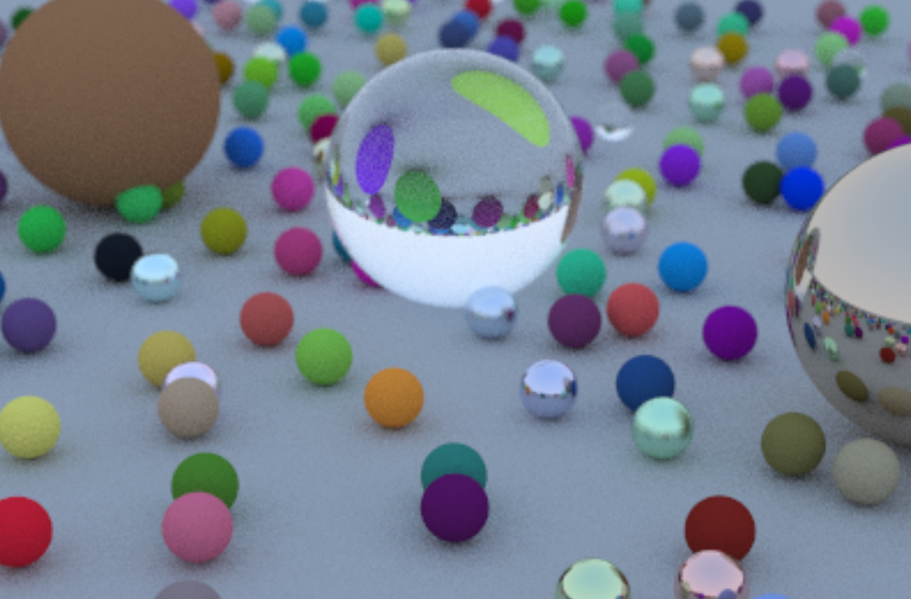

# Rust Ray Tracer

This is a project implementing a ray tracer in the Rust programming language, inspired by the book ["Ray Tracing in One Weekend"](https://raytracing.github.io/books/RayTracingInOneWeekend.html), by Peter Shirley. 

## Project Description

This project aims to provide a simple, yet effective, ray tracing program. Ray tracing is a rendering technique that can produce incredibly realistic lighting effects. Essentially, an algorithm can trace the path of light, and then simulate the effects of its encounters with virtual objects.

The program is written in Rust, a systems programming language that runs blazingly fast, prevents segfaults, and guarantees thread safety.

## Current Status

As of now, this project is capable of performing basic ray tracing with antialiasing. It supports three types of materials for the spheres:

- Diffuse material
- Metal
- Dielectric

Each material has its own unique properties. Additionally, the current implementation allows for camera positioning and defocus blur.

## Todos

Here are some of the features that I aim to implement in the future:

- **Add more 3D shapes**: Currently, the project only supports spheres. I plan to include more complicated geometries such as cylinders, which will require more complex intersection calculations.
- **Performance improvements**: Profiling the Rust code will help identify areas that are slowing it down and need improvement. My goal is to make it run instantly, at least on lower resolutions.
- **UI integration**: Once instant rendering is achieved, my next goal is to integrate the project with the [egui crate](https://github.com/emilk/egui), a simple and fast GUI library for Rust. This will allow users to interactively change the camera position.

## License
This project is licensed under the MIT License. See the `LICENSE` file for more information.

